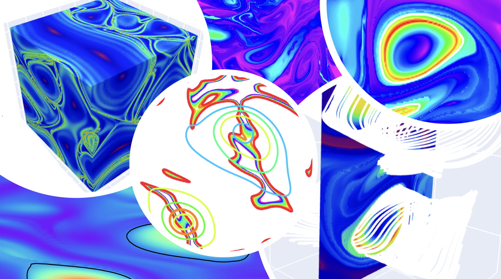

<h1 style="font-family:Helvetica;" align="left">
    TBarrier notebook collection
</h1>

TBarrier notebook collection contains a series of jupyter notebooks that guide you  through methods used to extract advective, diffusive, stochastic and active transport barriers from discrete velocity data.

## How to Use this Repository

- Run the code using the Jupyter notebooks available in this repository's [TBarrier](TBarrier) directory.

## Video tutorials:

Video tutorials for the individual jupyter notebooks can be found on Youtube:

[TBarrier video tutorials](https://youtube.com/playlist?list=PLJHY7IecnoJwGg7xPr2Qiw1-fmnIfPnLu)

## About

The notebooks are written and tested with Python 3.7.

Familiarity with Python and its core libraries [NumPy](http://numpy.org), [scipy](https://scipy.org/), [Matplotlib](http://matplotlib.org), [Scikit-Learn](http://scikit-learn.org) is assumed.

## Authors

Alex Pablo Encinas Bartos, Balint Kaszas and George Haller

## Software

The jupyter notebooks were tested with Python 3.7.

The libraries used to run this book are listed in [requirements.txt](requirements.txt).

For a complete [Installation-guideline](Installation.md) we refer to the 'Installation.md'in this repository.

You can read more about using conda environments in the [Managing Environments](http://conda.pydata.org/docs/using/envs.html) section of the conda documentation.

## License

### Code
The code in this repository, including all code samples in the notebooks listed above, is released under the [GNU license](LICENSE-CODE). Read more at the [Open Source Initiative](https://opensource.org/osd).

### Text
The text content of the book is released under the [CC-BY-NC-ND license](LICENSE-TEXT). Read more at [Creative Commons](https://creativecommons.org/licenses/by-nc-nd/3.0/us/legalcode).

### References

When using this code, please cite the following source for the underlying theory:
 
G. Haller, Transport Barriers and Coherent Structures in Flow Data– Advective, diffusive, stochastic and methods (with the assistance of A. Encinas-Bartos). Cambridge University Press (February 2023)

and the GitHub repository as:

Alex Pablo Encinas Bartos, Bálint Kaszás, & George Haller. (2023). haller-group/TBarrier: TBarrier (v1.0.0). Zenodo. https://doi.org/10.5281/zenodo.6779400
